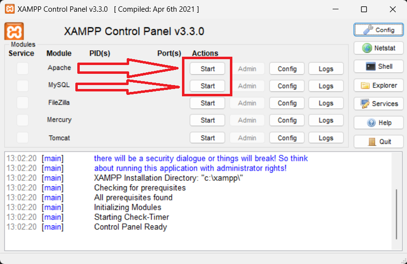
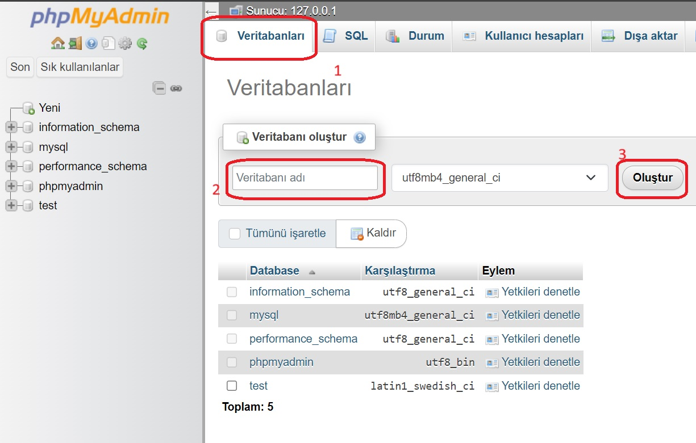

# Web-PHP-Proje

<h2>Projeyi Kendi Bilgisayarımda Nasıl Çalıştırırım ?</h2> 

1-) Öncelikle bilgisayarınıza xampp uygulamasını kurunuz. 
2-) Ardından Projenin kod doyalarını bilgisayarınıza indiriniz, daha önceden indirmiş olduğunuz xampp uygulamasını indirdiğiniz klasöre giriniz. İndirmiş olduğunuz proje dosyalarını xampp klasörü içindeki htdocs klasörünün içine yükleyiniz. 
3-) Ardından xampp uygulamasını açınız. 
 

Yukarıdaki gösterilen apache ve mysql start tuşlarına basınız. 

4-)Daha sonra bilgisayarınızdaki bir tarayıcıya(chrome,firefox, vb.) giriş yapınız ve adres çubuğuna localhost/phpmyadmin yazıp giriş yapınız. 

5-) Aşağıdaki ekran açıldığında;  
 
İlk olarak veritabanları butonuna tıklayınız. Açılan sayfada Veritabanı adı kısmına "veritabanim" yazınız. Yan taraftan görselde olduğu gibi seçim yaprak oluştur butnuna tıklayınız. 

6-) "veritabanim" isimli yapınız oluştuğunda yapmanız gereken son şey tarayıcınızın adres çubuğuna localhost yazıp giriş yapmaktır. Geri kalan herşeyi kodlar halledecektir.

<h2>YOUTUBE VİDEO LİNK</h2> 
<a href="https://www.youtube.com/watch?v=KzRT2WQ1Ae8">Video Link</a>

